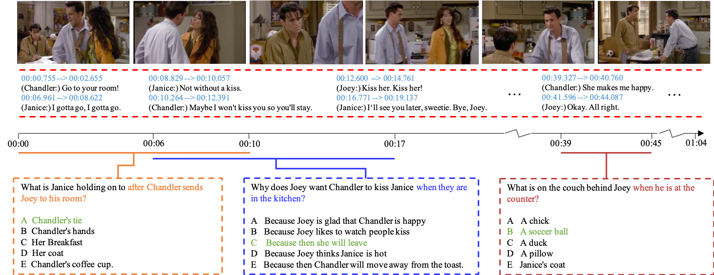
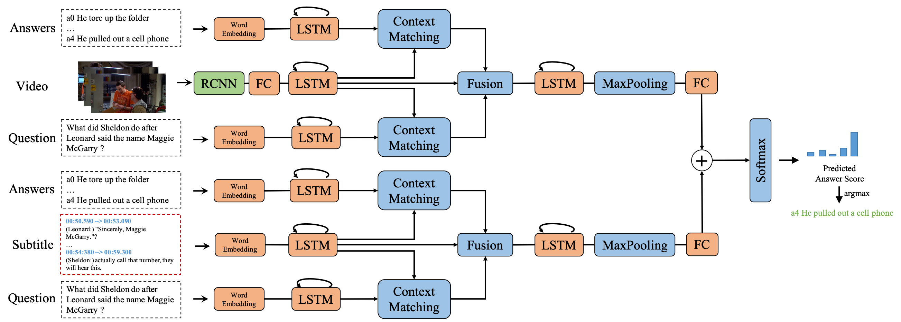

# TVQA
PyTorch code accompanies the [TVQA dataset paper](https://arxiv.org/abs/1809.01696), in EMNLP 2018


### Dataset
TVQA is a large-scale video QA dataset based on 6 popular TV shows 
(*Friends*, *The Big Bang Theory*, *How I Met Your Mother*, *House M.D.*, *Grey's Anatomy*, *Castle*). 
It consists of 152.5K QA pairs from 21.8K video clips, spanning over 460 hours of video. 
The questions are designed to be compositional, requiring systems to jointly localize 
relevant moments within a clip, comprehend subtitles-based dialogue, and recognize 
relevant visual concepts.

- QA example

    

    See examples in video: [click here](http://tvqa.cs.unc.edu/explore.html)
- Statistics

    | TV Show               | Genre   | #Season | #Episode | #Clip  | #QA     |
    |-----------------------|---------|---------|----------|--------|---------|
    | The Big Bang Theory   | sitcom  | 10      | 220      | 4,198  | 29,384  |
    | Friends               | sitcom  | 10      | 226      | 5,337  | 37,357  |
    | How I Met Your Mother | sitcom  | 5       | 72       | 1,512  | 10,584  |
    | Grey's Anatomy        | medical | 3       | 58       | 1,472  | 9,989   |
    | House M.D.            | medical | 8       | 176      | 4,621  | 32,345  |
    | Castle                | crime   | 8       | 173      | 4,698  | 32,886  |
    | Total                 | -       | 44      | 925      | 21,793 | 152,545 |


### Model Overview
A multi-stream model, each stream process different contextual inputs. 


### Requirements:
- Python 2.7
- PyTorch 0.4.0
- tensorboardX
- pysrt
- tqdm
- h5py
- numpy

### Video Features
- ImageNet feature: Extracted from ResNet101, 
  [Google Drive link](https://drive.google.com/a/cs.unc.edu/file/d/1wln-nuchbfLUc50AuG8g2YhEwyaHCH_T/view?usp=sharing)
- Regional Visual Feature: object-level encodings from object detector (too large to share ...)
- Visual Concepts Feature: object labels and attributes from object detector
  [download link](http://tvqa.cs.unc.edu/files/det_visual_concepts.pickle.tar.gz). This file is included in `download.sh`.

For object detector, we used Faster R-CNN trained on Visual Genome, please refer to this 
[repo](https://github.com/peteanderson80/bottom-up-attention).
  
### Usage

0. Clone this repo

    ```
    git clone https://github.com/jayleicn/TVQA.git
    ```

1. Download data

    Questions, answers and subtitles, etc. can be directly downloaded by executing the following command:
    ```
    bash download.sh
    ```
    For video frames and video features, please visit [TVQA Dwonload Page](http://tvqa.cs.unc.edu/index.html#download).

2. Preprocess data

    ```
    python preprocessing.py
    ```
    This step will process subtitle files and tokenize all textual sentence.

3. Build word vocabulary, extract relevant GloVe vectors
    
    For words that do not exist in GloVe, random vectors `np.random.randn(self.embedding_dim) * 0.4` are used. 
    `0.4` is the standard deviation of the GloVe vectors
    ```
    python tvqa_dataset.py
    ```

4. Training
    ```
    python main.py --input_streams sub
    ```

5. Inference
    ```
    python test.py --model_dir [results_dir] --mode valid
    ```

### Links
- Paper: https://arxiv.org/abs/1809.01696
- Dataset and Leaderboard: http://tvqa.cs.unc.edu/


### Citation
```
@inproceedings{lei2018tvqa,
  title={TVQA: Localized, Compositional Video Question Answering},
  author={Lei, Jie and Yu, Licheng and Bansal, Mohit and Berg, Tamara L},
  booktitle={EMNLP},
  year={2018}
}
```

### TODO
1. [x] Add data preprocessing scripts
2. [ ] Add baseline scripts
3. [x] Add model and training scripts
4. [x] Add test scripts


### Contact
- Dataset: faq-tvqa-unc [at] googlegroups.com
- Model: Jie Lei, jielei [at] cs.unc.edu
